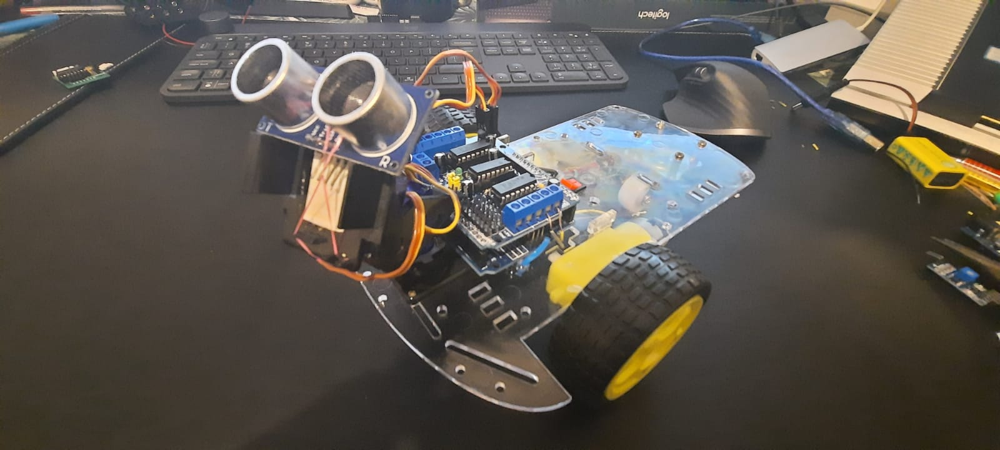

# robot mop 

 Dexter este un robot controlat de smartphone care curata orice suprafata din casa ta! Mopurile rotative din partea din fața a robotului împreună cu o rolă de varuit (folosită pentru vopsirea pereților, nu aici) în spate pot face treaba perfect. 

---

Principalele elemente folosite:

* Placa de dezvoltare Arduino UNO
* 4 motoare DC
* 2 Servo motoare
* Motor Shield Controller
* Senzor cu ultrasunete
* modul bluetooth HC-05/06
* pompă de apă 3-6V
* CD-uri vechi
* tuburi

    

Img

---
_project by Madalina-Lavinia Chelu_

